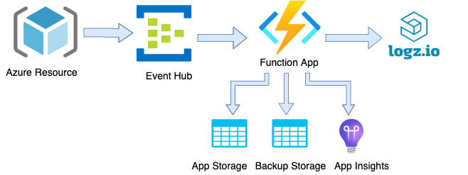

**This project is under development**

---

# azure-serverless
This repository contains the Python code and instructions to ship logs from your Azure services to Logz.io using an Azure Function. After completing the setup, your Azure Function will forward logs from an Azure Event Hub to your Logz.io account.



## Setting up Log Shipping from Azure

### 1. Deploy the Logz.io Python Template👇 

[](https://portal.azure.com/#create/Microsoft.Template/uri/https%3A%2F%2Fraw.githubusercontent.com%2Flogzio%2Fazure-serverless%2Fserverless-function%2Fdeployments%2Fazuredeploylogs.json)

This deployment will create the following services:
* Serverless Function App (Python-based)
* Event Hubs Namespace
* Event Hubs Instance
* Storage account: 
  - Function's logs containers
  - Failed shipments logs container
* App Service Plan
* Application Insights

### Alternative Setup using Terraform

As an alternative to the Azure Template, you can use Terraform to set up your log shipping environment. The Terraform configuration files are located in the **deployments** folder of this repository. Follow the instructions below to deploy this integration using Terraform.

#### Prerequisites
- Terraform installed on your local machine.
- Azure CLI installed and configured with your Azure account credentials.

#### Steps to Deploy using Terraform
1. **Obtain the Terraform Configuration**: Clone or download this repository to get the Terraform configuration files.
   ```bash
   git clone https://github.com/logzio/azure-serverless.git
   cd azure-serverless/deployments
   ```

2. **Create a `.tfvars` File**: Create a `terraform.tfvars` file in the **deployments** folder to specify your configurations, such as your Logz.io token.
    ```hcl
    logzio_url = "<your-logzio-account-listener-host>:8071"
    logzio_token = "<your-logzio-log-shipping-token>"
    thread_count = 4
    buffer_size = 100
    interval_time = 10000
    max_tries = 3
    log_type = "eventHub"
   
3. **Initialize Terraform**: Run the Terraform initialization to install the necessary plugins.
   ```bash
    terraform init
   ```

4. **Apply Terraform Configuration**: Deploy the infrastructure using `terraform apply`. You will be prompted to review the proposed changes before applying the configuration.
   ```bash
    terraform apply
   ```
    Type **yes** when prompted to confirm the deployment.
5. **Verify Deployment**: After successful application of the Terraform configuration, your Azure services will be set up and ready for log shipping.


### 2. Configure the Template

Use these settings when configuring the template:

| Parameter       | Description                                                             |
|-----------------|-------------------------------------------------------------------------|
| Resource group* | Create a new resource group or select an existing one.                  |
| Region*         | Select the region closest to your Azure services.                       |
| LogzioURL*      | Use the listener URL specific to your Logz.io account region.           |
| LogzioToken*    | Your Logz.io logs shipping token.                                       |
| ThreadCount     | Number of threads for the Function App (default: 4).                    |
| bufferSize      | Maximum number of messages to accumulate before sending (default: 100). |
| intervalTime    | Interval time for sending logs in milliseconds (default: 10000).        |
| maxTries        | The maximum number of retries for the backoff mechanism (default: 3).   |
| logType         | The type of the logs being processed (default: eventHub).               |


*Required fields.

After setting the parameters, click **Review + Create**, and then **Create** to deploy.

### 3. Stream Azure Service Data

Configure your Azure services to stream logs to the newly created Event Hub. For each service:

1. Create diagnostic settings.
2. Under **Event hub policy name**, select the appropriate policy (e.g., 'RootManageSharedAccessKey').

For more details, see [Microsoft's documentation](https://docs.microsoft.com/en-us/azure/monitoring-and-diagnostics/monitor-stream-monitoring-data-event-hubs).

### 4. Verify Data Reception in Logz.io

Allow some time for data to flow from Azure to Logz.io, then check your Logz.io account. You should see logs of the type `eventHub` in Logz.io.

### Backup for Unshipped Logs

The deployment includes a backup mechanism for logs that fail to ship to Logz.io. By default, these logs are stored in the **failedlogbackup** blob container, but this can be customized to a different container name of your choice during the setup process.

### Post-Deployment Configuration

To modify configuration after deployment, visit your Function App's **Configuration** tab. You can adjust settings such as `LogzioURL`, `LogzioToken`, `bufferSize`, and more.

## Changelog

- Version 0.0.1:
  * Initial release with Python Azure Function.
  * Implement log shipping to Logz.io.
  * Backup mechanism for failed log shipments.
  * Customizable log batching and threading.
